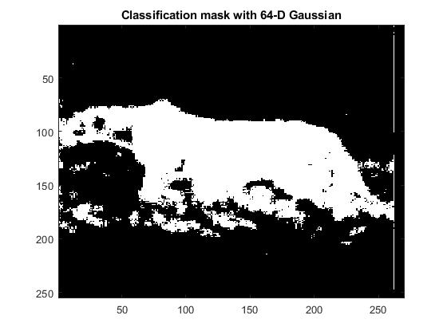

Image segregation using BDR
==============================

The given image of a cheetah in the grass is segregated into the background and the cheetah using Bayes Decision Rule.
The Discrete Cosine Transform used to get the features and the class conditional densities are modelled as 64 dimensional Gaussians.
Maximum Likelihood estimation and Bayes estimation were used to estimate the parameters of the Gaussian. 
The change in accuracy of classification with the change in confidence of the prior was also studied for the Bayes method.

                                               
                                                                          
